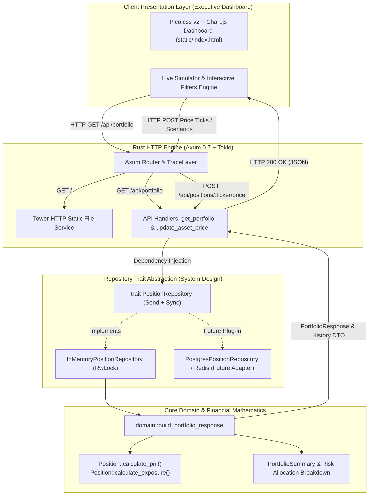
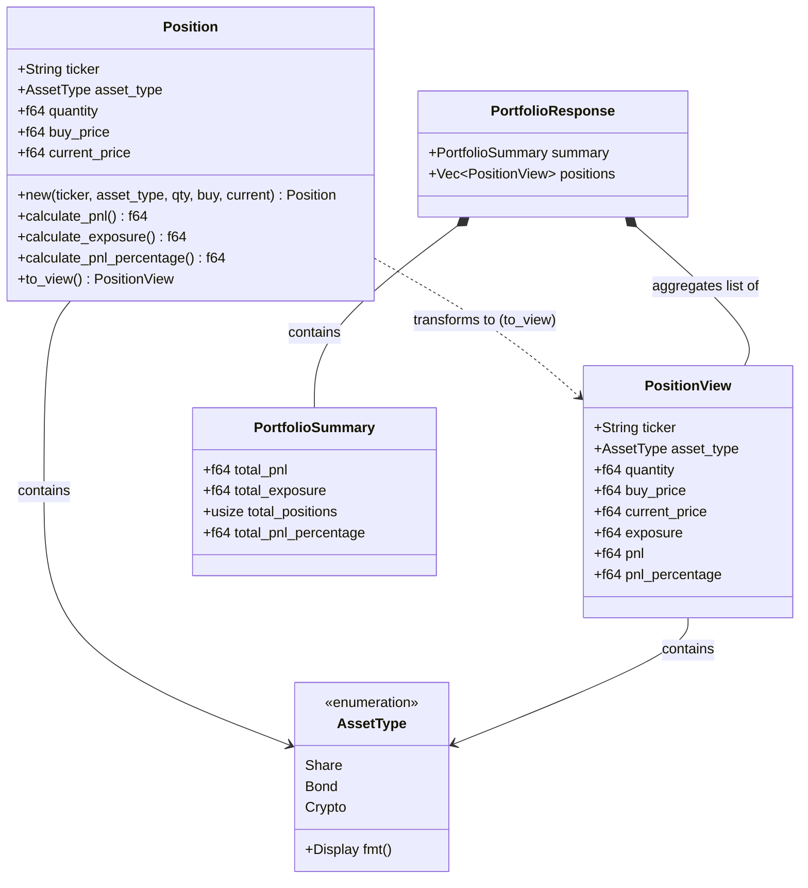
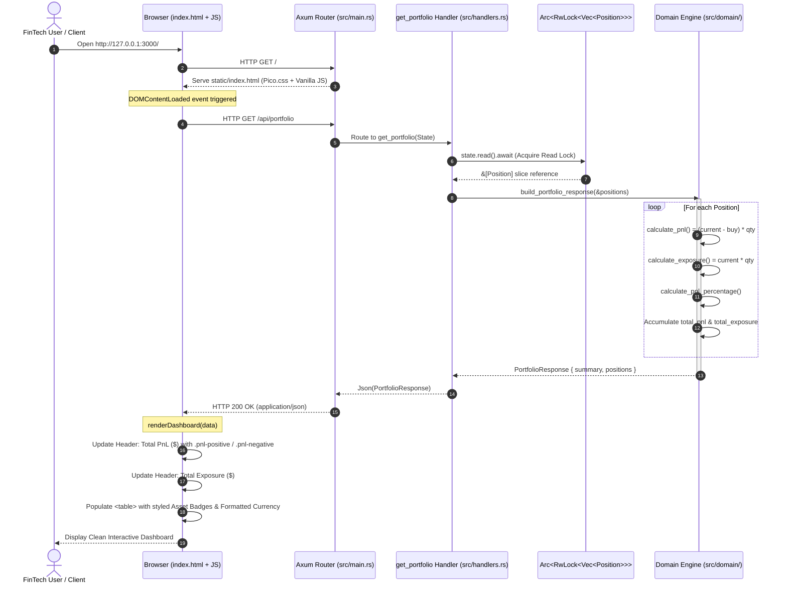

# 🏛️ Position & Risk Engine MVP (Rust + Axum)

A high-performance, strongly-typed **Position & Risk Engine MVP** built in Rust for multi-asset portfolios (Equities, Sovereign Bonds, Cryptocurrencies). 

Designed to demonstrate **clean domain modeling**, **financial precision**, **zero `unwrap()` safety**, and **clean API design** using Axum, Tokio, Serde, and Pico.css.

---

## 📐 System Architecture

### 1. High-Level Architecture Diagram (Hexagonal / Repository Pattern)


---

### 2. Classes & Domain Model Diagram (UML)


---

### 3. Request Lifecycle & Sequence Diagram


---

## ⚡ Key Highlights for Technical Review

1. **Domain-Driven Design (DDD)**:
   - Financial assets categorized using `AssetType` enum (`Share`, `Bond`, `Crypto`).
   - `Position` struct encapsulates financial units, cost basis, and current mark-to-market prices.
   - Separation between domain models (`Position`) and API representation (`PositionView`, `PortfolioResponse`).

2. **Financial Business Logic**:
   - **Unrealized PnL (Profit and Loss)**:
     $$\text{PnL} = (\text{Current Price} - \text{Buy Price}) \times \text{Quantity}$$
     - *Green (+)*: Profitable position (e.g., AAPL: `+$200.00`, US10Y: `+$250.00`)
     - *Red (-)*: Drawdown / Loss position (e.g., BTC: `-$2,500.00`)
   - **Gross Exposure**:
     $$\text{Exposure} = \text{Current Price} \times \text{Quantity}$$
     - Represents the total market capital at risk (Total: `$34,450.00`).
   - **Return on Capital (%)**:
     $$\text{PnL \%} = \left(\frac{\text{Current Price} - \text{Buy Price}}{\text{Buy Price}}\right) \times 100$$
     - Division-by-zero guarded for synthetic / zero-cost assets.

3. **Production Safety & Idiomatic Rust**:
   - **Zero `.unwrap()` in business logic**: calculations are deterministic and resilient.
   - **Comprehensive `#[cfg(test)]` coverage**: Unit tests validating PnL, exposure, and edge cases for all asset classes.
   - **Structured Observability**: Integrated with `tracing` & `tracing-subscriber` for HTTP diagnostics.

4. **Clean, Minimalist Frontend**:
   - **Pico.css v2**: Semantic dark-mode UI with zero CSS bloat.
   - **Dynamic Conditional Styling**: Real-time coloring for profit (`#4caf50`) and loss (`#ff5252`).

---

## 📊 Portfolio Summary Example (11 Active Positions)

| Ticker | Asset Class | Quantity | Buy Price | Current Price | Exposure | Unrealized PnL | Return (%) |
| :--- | :--- | :---: | :---: | :---: | :---: | :---: | :---: |
| **AAPL** | `Share` | 10.0 | $150.00 | $170.00 | **$1,700.00** | <span style="color:#4caf50">**+$200.00**</span> | <span style="color:#4caf50">+13.33%</span> |
| **NVDA** | `Share` | 15.0 | $110.00 | $135.00 | **$2,025.00** | <span style="color:#4caf50">**+$375.00**</span> | <span style="color:#4caf50">+22.73%</span> |
| **MSFT** | `Share` | 8.0 | $420.00 | $445.00 | **$3,560.00** | <span style="color:#4caf50">**+$200.00**</span> | <span style="color:#4caf50">+5.95%</span> |
| **TSLA** | `Share` | 12.0 | $220.00 | $195.00 | **$2,340.00** | <span style="color:#ff5252">**-$300.00**</span> | <span style="color:#ff5252">-11.36%</span> |
| **AMZN** | `Share` | 20.0 | $180.00 | $185.00 | **$3,700.00** | <span style="color:#4caf50">**+$100.00**</span> | <span style="color:#4caf50">+2.78%</span> |
| **BTC** | `Crypto` | 0.5 | $60,000.00 | $55,000.00 | **$27,500.00** | <span style="color:#ff5252">**-$2,500.00**</span> | <span style="color:#ff5252">-8.33%</span> |
| **ETH** | `Crypto` | 4.0 | $3,200.00 | $3,450.00 | **$13,800.00** | <span style="color:#4caf50">**+$1,000.00**</span> | <span style="color:#4caf50">+7.81%</span> |
| **SOL** | `Crypto` | 25.0 | $140.00 | $160.00 | **$4,000.00** | <span style="color:#4caf50">**+$500.00**</span> | <span style="color:#4caf50">+14.29%</span> |
| **US10Y** | `Bond` | 50.0 | $100.00 | $105.00 | **$5,250.00** | <span style="color:#4caf50">**+$250.00**</span> | <span style="color:#4caf50">+5.00%</span> |
| **BUND10Y** | `Bond` | 40.0 | $98.00 | $96.50 | **$3,860.00** | <span style="color:#ff5252">**-$60.00**</span> | <span style="color:#ff5252">-1.53%</span> |
| **UKGILT** | `Bond` | 30.0 | $102.00 | $104.00 | **$3,120.00** | <span style="color:#4caf50">**+$60.00**</span> | <span style="color:#4caf50">+1.96%</span> |

### Portfolio Executive Aggregates
- **Total Portfolio PnL**: `-$175.00`
- **Total Gross Exposure**: `$70,855.00`
- **Active Asset Positions**: `11`
- **Total Portfolio Return**: `-0.25%`

---

## 🚀 Getting Started

### 1. Run Automated Tests
```bash
cargo test
```

### 2. Launch Locally (Bare Metal)
```bash
cargo run
```
The server starts at `http://localhost:3000`.

### 3. Launch via Docker Container 🐳
You can build and run the engine inside a lightweight container using **Docker** or **Docker Compose**:

```bash
# Option A: Using Docker Compose
docker compose up --build

# Option B: Using Docker CLI
docker build -t position-risk-engine .
docker run -p 3000:3000 position-risk-engine
```

### 4. Endpoints
- **Web Dashboard**: Open [`http://localhost:3000/`](http://localhost:3000/) in your browser.
- **REST API**:
  ```bash
  curl -s http://localhost:3000/api/portfolio | jq .
  ```

---

## 🏗️ Project Structure

```text
position-and-risk-engine/
├── Cargo.toml               # Dependencies: axum, tokio, serde, tower-http, tracing
├── src/
│   ├── main.rs              # Axum router, state, and static directory mounting
│   ├── domain/              # Core domain models and financial mathematics
│   │   ├── mod.rs           # Module re-exports
│   │   ├── asset.rs         # AssetType enum (Share, Bond, Crypto)
│   │   ├── position.rs      # Position struct, PnL & Exposure logic & unit tests
│   │   └── portfolio.rs     # Portfolio aggregation metrics & unit tests
│   ├── handlers.rs          # Axum HTTP handlers (GET /api/portfolio)
│   └── mock_data.rs         # In-memory mock multi-asset portfolio
├── static/
│   └── index.html           # Pico.css dashboard with dynamic Vanilla JS rendering
└── README.md                # Project documentation and interview talking points
```